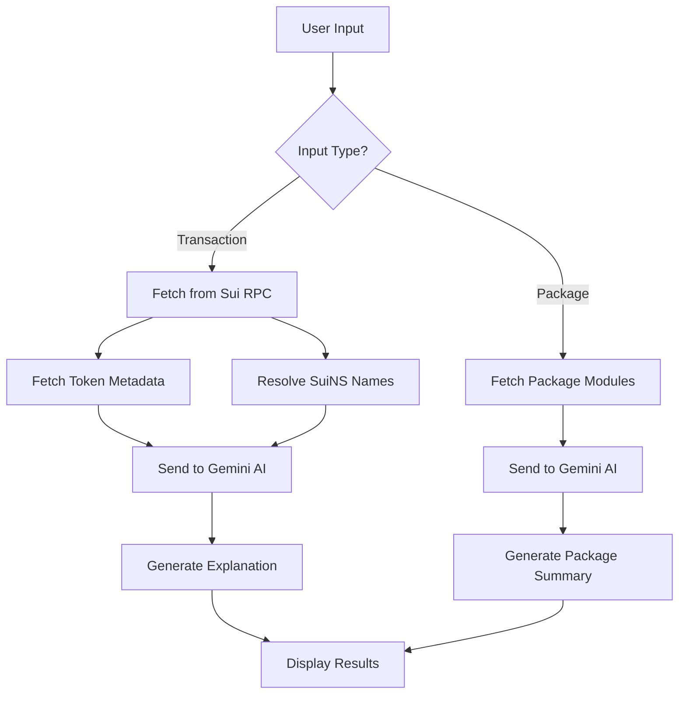

<h1 align="center">⚡ TxSense</h1>

<p align="center">
  <strong>Translating complex Sui blockchain transactions into plain English</strong><br />
  Paste a transaction digest, link, or package ID — get a clear, human-readable breakdown instantly.
</p>

<p align="center">
  <a href="https://txsense.netlify.app" target="_blank"><strong>🚀 Live Demo → txsense.netlify.app</strong></a>
</p>

---

## 📖 Table of Contents

- [What is TxSense?](#what-is-txsense)
- [Features](#features)
- [Technology Stack](#technology-stack)
- [Getting Started](#getting-started)
- [Project Structure](#project-structure)
- [How It Works](#how-it-works)
- [Services Documentation](#services-documentation)
- [Deployment](#deployment)
- [Integration Examples](#integration-examples)
- [Future Improvements](#future-improvements)
- [Contributing](#contributing)

---

## 🎯 What is TxSense?

Sui blockchain transactions can be complex and difficult to understand. Between long hex strings, cryptic digests, object references, Move calls, and gas details, deciphering what actually happened in a transaction requires deep blockchain knowledge.

**TxSense solves this problem** by using AI-powered analysis to translate blockchain transactions into plain English explanations that anyone can understand.

### Perfect for:

- 💼 **DeFi Users** — Track transfers, swaps, and protocol interactions
- 👨‍💻 **Developers** — Debug Move modules and Programmable Transaction Blocks (PTBs)
- 🎓 **Newcomers** — Explore Sui without getting lost in complex explorers
- 🏗️ **dApp Builders** — Understand transaction flows and protocol integrations

### What You Can Analyze:

1. **Transaction Digests** — From Sui Explorer or any source
2. **Transaction Links** — Direct URLs from explorers
3. **Package IDs** — Analyze Move packages and their modules
4. **Random Transactions** — Explore real Sui transactions with the "Roll the dice" 🎲 feature

---

## ✨ Features

### Core Features

- ✅ **Simple Interface** — Just paste and go
- ✅ **AI-Powered Explanations** — Uses Google Gemini to generate human-readable summaries
- ✅ **Transaction Deep Dive** — Detailed step-by-step breakdowns with emojis and context
- ✅ **Visual Flowcharts** — Mermaid diagrams showing transaction flows
- ✅ **SuiNS Integration** — Displays human-readable names like `alice.sui` instead of addresses
- ✅ **Token Metadata** — Fetches and displays coin symbols, decimals, and icons
- ✅ **Package Analysis** — Analyze Move packages, modules, and their capabilities
- ✅ **Protocol Detection** — Identifies known protocols (Cetus, DeepBook, Aftermath, etc.)
- ✅ **Random Transaction Explorer** — Discover random on-chain transactions
- ✅ **Rate Limiting** — Client-side protection (3 requests per minute)
- ✅ **Responsive Design** — Beautiful sticker-style UI that works on all devices

### Data Sources

- **Sui RPC** — Official Sui mainnet full node
- **Aftermath Finance API** — Rich token metadata with icons
- **SuiNS Protocol** — Human-readable address names
- **Google Gemini AI** — Natural language generation

---

## 🛠️ Technology Stack

### Frontend

- **React 19** — Latest React with modern features
- **TypeScript** — Type-safe development
- **Vite** — Lightning-fast build tool
- **Tailwind CSS** — Utility-first styling (implied from classNames)

### Services & APIs

- **@mysten/sui** — Official Sui SDK
- **@mysten/suins** — SuiNS name resolution
- **@google/genai** — Google Gemini AI integration
- **Aftermath Finance API** — Token metadata service

### Deployment

- **Netlify** — Serverless hosting with automatic deployments

---

## 🏗️ Architecture

### Project Structure

```
txsense/
├── components/           # React components
│   ├── CoinImage.tsx     # Coin icon display
│   ├── MermaidChart.tsx  # Mermaid flowchart renderer
│   ├── PackageResult.tsx # Package analysis results
│   └── TransactionResult.tsx # Transaction analysis results
├── services/             # Business logic & API clients
│   ├── aftermathService.ts   # Aftermath Finance API
│   ├── geminiService.ts      # Google Gemini AI
│   ├── rateLimitService.ts   # Client-side rate limiting
│   ├── suinsService.ts       # SuiNS name resolution
│   └── suiService.ts         # Sui RPC client
├── App.tsx              # Main application component
├── constants.ts         # Configuration & known packages
├── types.ts             # TypeScript type definitions
├── index.tsx            # Application entry point
├── vite.config.ts       # Vite configuration
└── package.json         # Dependencies
```

### Data Flow



---

## 🚀 Getting Started

### Prerequisites

- Node.js 18+ and pnpm (or npm/yarn)
- Google Gemini API Key ([Get one here](https://makersuite.google.com/app/apikey))

### Installation

```bash
# Clone the repository
git clone https://github.com/yourusername/txsense.git
cd txsense

# Install dependencies
pnpm install

# Set up environment variables
echo "API_KEY=your_google_gemini_api_key_here" > .env

# Run the development server
pnpm dev

# Open http://localhost:5173 in your browser
```

### Building for Production

```bash
pnpm build      # Output will be in /dist folder
pnpm preview    # Preview production build
```

### Configuration

Edit `.env` file:
```env
API_KEY=your_google_gemini_api_key_here
```

Edit [constants.ts](constants.ts) to customize known protocols:
```typescript
export const KNOWN_PACKAGES: KnownPackage[] = [
  { id: '0x...', name: 'Your Protocol Name' },
];
```

---

## 📁 Project Structure

```
txsense/
├── components/           # React components
│   ├── CoinImage.tsx     # Token icon display
│   ├── MermaidChart.tsx  # Flowchart renderer
│   ├── PackageResult.tsx # Package analysis display
│   └── TransactionResult.tsx # Transaction analysis display
├── services/             # Business logic & API clients
│   ├── aftermathService.ts   # Aftermath Finance API
│   ├── geminiService.ts      # Google Gemini AI
│   ├── rateLimitService.ts   # Client-side rate limiting
│   ├── suinsService.ts       # SuiNS name resolution
│   └── suiService.ts         # Sui RPC client
├── App.tsx              # Main application component
├── constants.ts         # Configuration & known packages
├── types.ts             # TypeScript type definitions
├── index.tsx            # Application entry point
└── vite.config.ts       # Vite configuration
```

---

## 🔍 How It Works

### 1. Input Identification

The app parses user input to detect:
- Transaction digests (64-char hex)
- Sui Explorer URLs
- Package IDs (hex addresses)

### 2. Data Fetching

**For Transactions:**
- Fetches transaction details from Sui RPC
- Retrieves token metadata from Aftermath Finance (fast) + Sui RPC (fallback)
- Resolves SuiNS names for addresses
- All done in parallel for speed

**For Packages:**
- Fetches Move modules and bytecode
- Extracts function signatures

### 3. AI Processing

Sends pruned transaction data to Google Gemini with:
- Known protocol context
- Token metadata
- SuiNS names
- Structured prompts for consistent output

Gemini returns:
- Plain English summary
- Step-by-step technical breakdown
- Mermaid flowchart code
- Protocol identification
- Action classification

### 4. Result Display

- Renders formatted explanations
- Shows visual flowcharts
- Displays token icons and names
- Includes shortcut links to explorers

---

## 📚 Services Documentation

### `suiService.ts` - Sui Blockchain Interaction

**Key Functions:**
- `fetchTransactionDetails(digest)` → Get transaction data with all details
- `fetchCoinMetadataBatch(coinTypes)` → Batch fetch token metadata with caching
- `fetchPackageModules(packageId)` → Get Move package modules
- `fetchRandomTransactionDigest()` → Random mainnet transaction
- `identifyInput(input)` → Parse and extract ID from user input

**Features:**
- In-memory caching for coin metadata
- Batch RPC calls to reduce network requests
- Supports transaction digests, Explorer URLs, and package IDs

### `geminiService.ts` - AI-Powered Analysis

**Key Functions:**
- `generateExplanation(txData, coinMetadata, suinsNames)` → Transaction explanation
- `generatePackageExplanation(packageId, modules)` → Package analysis
- `pruneTxData(txData)` → Remove unnecessary data before sending to AI

**Prompt Engineering:**
- Provides known protocol context for accurate identification
- Detailed style guidelines (emojis, formatting, tone)
- Instructs AI to use SuiNS names and format numbers cleanly

### `aftermathService.ts` - Token Metadata

**Key Functions:**
- `fetchAftermathCoinMetadatas(coinTypes)` → Batch fetch token metadata

**Benefits:**
- Faster than Sui RPC
- Includes token icons
- Covers popular Sui tokens

### `suinsService.ts` - Name Resolution

**Key Functions:**
- `resolveSuinsNames(addresses)` → Resolve `.sui` names for addresses

**Features:**
- Batch parallel resolution
- Graceful fallback if names don't exist

### `rateLimitService.ts` - Rate Limiting

**Configuration:**
- 3 requests per minute
- LocalStorage-based tracking
- Automatic cooldown timer

---

## 🚀 Deployment

### Deploy to Netlify (Recommended)

1. **Push to GitHub**
   ```bash
   git push origin main
   ```

2. **Connect to Netlify**
   - Go to [Netlify](https://netlify.com)
   - Click "Add new site" → "Import an existing project"
   - Choose your GitHub repository
   - Build settings:
     - Build command: `npm run build`
     - Publish directory: `dist`

3. **Add Environment Variables**
   - Go to Site settings → Environment variables
   - Add `API_KEY` with your Gemini API key
   - Redeploy

### Deploy to Vercel

```bash
# Install Vercel CLI
npm i -g vercel

# Deploy
vercel
```

### Self-Hosted (Nginx)

```bash
# Build
npm run build

# Copy to server
scp -r dist/* user@server:/var/www/txsense/
```

**Nginx Configuration:**
```nginx
server {
    listen 80;
    server_name txsense.yourdomain.com;
    root /var/www/txsense;
    index index.html;
    
    location / {
        try_files $uri $uri/ /index.html;
    }
}
```

### Docker

```dockerfile
FROM node:20-alpine AS builder
WORKDIR /app
COPY package*.json ./
RUN npm install
COPY . .
RUN npm run build

FROM nginx:alpine
COPY --from=builder /app/dist /usr/share/nginx/html
EXPOSE 80
CMD ["nginx", "-g", "daemon off;"]
```

```bash
docker build -t txsense .
docker run -p 3000:80 txsense
```

---

## 🔌 Integration Examples

### React/TypeScript

```typescript
// lib/txsense.ts
import axios from 'axios';

export const txsenseClient = axios.create({
  baseURL: 'https://api.txsense.io/v1',
  headers: { 'X-API-Key': process.env.TXSENSE_API_KEY }
});

export async function explainTransaction(digest: string) {
  const { data } = await txsenseClient.post('/analyze/transaction', {
    digest,
    options: { includeMermaid: true, resolveSuins: true }
  });
  return data;
}
```

### React Hook

```typescript
import { useState } from 'react';

export function useTxAnalysis() {
  const [loading, setLoading] = useState(false);
  const [result, setResult] = useState(null);

  const analyze = async (digest: string) => {
    setLoading(true);
    try {
      const analysis = await explainTransaction(digest);
      setResult(analysis);
    } finally {
      setLoading(false);
    }
  };

  return { analyze, loading, result };
}
```

### Wallet Integration (Sui dApp Kit)

```typescript
import { useSignAndExecuteTransactionBlock } from '@mysten/dapp-kit';

export function useTransactionWithExplanation() {
  const { mutateAsync: signAndExecute } = useSignAndExecuteTransactionBlock();

  const executeAndExplain = async (tx: any) => {
    // Execute transaction
    const result = await signAndExecute({ transactionBlock: tx });
    
    // Wait and explain
    await new Promise(resolve => setTimeout(resolve, 2000));
    const analysis = await explainTransaction(result.digest);
    
    return { result, analysis };
  };

  return { executeAndExplain };
}
```

### Move Smart Contract Integration

```move
// Emit transaction events for off-chain analysis
module my_protocol::transactions {
    use sui::event;
    use std::string::String;

    struct TransactionCompleted has copy, drop {
        digest: vector<u8>,
        user: address,
        action: String
    }

    public fun emit_completed(digest: vector<u8>, user: address, action: String) {
        event::emit(TransactionCompleted { digest, user, action });
    }
}
```

### Backend Integration (Express)

```typescript
import express from 'express';
import { explainTransaction } from './lib/txsense';

app.post('/api/transactions/:digest/explain', async (req, res) => {
  try {
    const analysis = await explainTransaction(req.params.digest);
    res.json({ success: true, explanation: analysis.summary });
  } catch (error) {
    res.status(500).json({ error: error.message });
  }
});
```

---

## 🚀 Future Improvements

### 1. Multi-Network Support (Devnet & Testnet)

**Current State:**  
TxSense only supports Sui **Mainnet** transactions.

**Planned Enhancement:**  
Add automatic network detection and support for **Devnet** and **Testnet**.

**Implementation Plan:**

```typescript
// constants.ts - Add network configurations
export const NETWORK_CONFIGS = {
  mainnet: {
    rpcUrl: 'https://fullnode.mainnet.sui.io:443',
    explorerUrl: 'https://suivision.xyz/txblock/'
  },
  testnet: {
    rpcUrl: 'https://fullnode.testnet.sui.io:443',
    explorerUrl: 'https://testnet.suivision.xyz/txblock/'
  },
  devnet: {
    rpcUrl: 'https://fullnode.devnet.sui.io:443',
    explorerUrl: 'https://devnet.suivision.xyz/txblock/'
  }
};

// Add network detection based on input URL patterns
export function detectNetwork(input: string): 'mainnet' | 'testnet' | 'devnet' {
  if (input.includes('testnet')) return 'testnet';
  if (input.includes('devnet')) return 'devnet';
  // Try to fetch from each network sequentially
  return 'mainnet'; // default
}
```

**Benefits:**
- Developers can analyze testnet transactions during development
- Support for devnet experimentation
- Better debugging across all environments

---

### 2. Scalable Backend Architecture

**Current Limitation:**  
TxSense runs entirely in the browser with API keys exposed in the frontend. This limits scalability and security.

**Proposed Solution:**  
Build a backend API service that handles all blockchain and AI interactions.

#### Backend Architecture

```
┌─────────────────────────────────────────────────────────┐
│                    Frontend (React)                     │
│  - UI Components                                        │
│  - User Input Handling                                  │
│  - Result Display                                       │
└─────────────────┬───────────────────────────────────────┘
                  │ HTTPS
                  ▼
┌─────────────────────────────────────────────────────────┐
│              Backend API (Node.js/Express)              │
│  ┌───────────────────────────────────────────────────┐ │
│  │  API Routes                                       │ │
│  │  - POST /api/analyze/transaction                  │ │
│  │  - POST /api/analyze/package                      │ │
│  │  - GET  /api/transaction/random                   │ │
│  │  - GET  /api/metadata/tokens                      │ │
│  └───────────────────────────────────────────────────┘ │
│  ┌───────────────────────────────────────────────────┐ │
│  │  Middleware                                       │ │
│  │  - Rate Limiting (Redis)                          │ │
│  │  - Authentication (API Keys)                      │ │
│  │  - Request Validation                             │ │
│  │  - CORS                                           │ │
│  └───────────────────────────────────────────────────┘ │
│  ┌───────────────────────────────────────────────────┐ │
│  │  Services Layer                                   │ │
│  │  - Sui RPC Client                                 │ │
│  │  - Gemini AI Client                               │ │
│  │  - Cache Manager (Redis)                          │ │
│  │  - SuiNS Resolver                                 │ │
│  └───────────────────────────────────────────────────┘ │
└─────────────────┬───────────────────────────────────────┘
                  │
    ┌─────────────┼─────────────┐
    │             │             │
    ▼             ▼             ▼
┌────────┐  ┌──────────┐  ┌──────────┐
│  Sui   │  │  Gemini  │  │  Redis   │
│  RPC   │  │   AI     │  │  Cache   │
└────────┘  └──────────┘  └──────────┘
```

#### Backend Implementation Guide

##### Tech Stack Recommendation

- **Runtime:** Node.js 20+ with TypeScript
- **Framework:** Express.js or Fastify
- **Caching:** Redis for transaction cache & rate limiting
- **Database:** PostgreSQL (optional, for analytics)
- **Deployment:** Docker + Kubernetes / AWS Lambda / Vercel

##### Step 1: Initialize Backend Project

```bash
mkdir txsense-backend
cd txsense-backend
npm init -y
npm install express cors dotenv redis @mysten/sui @google/genai
npm install -D typescript @types/node @types/express ts-node
```

##### Step 2: Core API Endpoints

```typescript
// src/routes/analyze.ts
import express from 'express';
import { analyzeTransaction } from '../services/analyzer';

const router = express.Router();

// Analyze transaction endpoint
router.post('/transaction', async (req, res) => {
  try {
    const { digest, network = 'mainnet' } = req.body;
    
    if (!digest) {
      return res.status(400).json({ error: 'Transaction digest required' });
    }
    
    const result = await analyzeTransaction(digest, network);
    res.json(result);
  } catch (error) {
    res.status(500).json({ error: error.message });
  }
});

// Analyze package endpoint
router.post('/package', async (req, res) => {
  try {
    const { packageId, network = 'mainnet' } = req.body;
    
    if (!packageId) {
      return res.status(400).json({ error: 'Package ID required' });
    }
    
    const result = await analyzePackage(packageId, network);
    res.json(result);
  } catch (error) {
    res.status(500).json({ error: error.message });
  }
});

export default router;
```

##### Step 3: Caching Strategy

```typescript
// src/services/cache.ts
import Redis from 'redis';

const redis = Redis.createClient({
  url: process.env.REDIS_URL
});

export async function getCachedTransaction(digest: string) {
  const cached = await redis.get(`tx:${digest}`);
  return cached ? JSON.parse(cached) : null;
}

export async function setCachedTransaction(digest: string, data: any) {
  // Cache for 24 hours
  await redis.setEx(`tx:${digest}`, 86400, JSON.stringify(data));
}
```

##### Step 4: Rate Limiting

```typescript
// src/middleware/rateLimit.ts
import rateLimit from 'express-rate-limit';
import RedisStore from 'rate-limit-redis';
import Redis from 'redis';

const client = Redis.createClient({ url: process.env.REDIS_URL });

export const apiLimiter = rateLimit({
  store: new RedisStore({
    client: client,
    prefix: 'rate_limit:'
  }),
  windowMs: 60 * 1000, // 1 minute
  max: 10, // 10 requests per minute per IP
  message: 'Too many requests, please try again later.'
});
```

##### Step 5: Authentication for Partners

```typescript
// src/middleware/auth.ts
export function authenticateApiKey(req, res, next) {
  const apiKey = req.headers['x-api-key'];
  
  if (!apiKey) {
    return res.status(401).json({ error: 'API key required' });
  }
  
  // Validate API key (check against database)
  const isValid = await validateApiKey(apiKey);
  
  if (!isValid) {
    return res.status(403).json({ error: 'Invalid API key' });
  }
  
  next();
}
```

---

### 3. Public API for Sui Builders

**Vision:**  
Provide a developer-friendly API that any Sui protocol or dApp can integrate to offer transaction explanations to their users.

#### API Documentation

##### Base URL
```
https://api.txsense.io
```

##### Authentication
```bash
# Include API key in headers
X-API-Key: your_api_key_here
```

##### Endpoints

###### 1. Analyze Transaction

**POST** `/v1/analyze/transaction`

Analyze a Sui transaction and get human-readable explanation.

**Request:**
```json
{
  "digest": "9x4...abc",
  "network": "mainnet",  // optional: mainnet | testnet | devnet
  "options": {
    "includeMermaid": true,
    "includeMetadata": true,
    "resolveSuins": true
  }
}
```

**Response:**
```json
{
  "digest": "9x4...abc",
  "network": "mainnet",
  "timestamp": "2026-02-13T10:30:00Z",
  "analysis": {
    "summary": "👤 alice.sui sent 100 USDC to bob.sui via Cetus DEX",
    "technicalPlayByPlay": "First, 👤 alice.sui (0x418c...9f67)...",
    "protocol": "Cetus DEX",
    "actionType": "Swap",
    "involvedParties": [
      {
        "address": "0x418c...9f67",
        "role": "sender",
        "suinsName": "alice.sui"
      }
    ]
  },
  "mermaid": "graph LR; ...",
  "metadata": {
    "gasUsed": "0.002 SUI",
    "status": "success"
  }
}
```

###### 2. Analyze Package

**POST** `/v1/analyze/package`

Analyze a Move package and understand its capabilities.

**Request:**
```json
{
  "packageId": "0x1eab...",
  "network": "mainnet"
}
```

**Response:**
```json
{
  "packageId": "0x1eab...",
  "summary": "Cetus DEX - A concentrated liquidity AMM protocol",
  "modules": ["pool", "swap", "liquidity"],
  "capabilities": [
    "Swap tokens with low slippage",
    "Provide liquidity for fees",
    "Create new pools"
  ]
}
```

###### 3. Get Random Transaction

**GET** `/v1/transaction/random?network=mainnet`

Get a random transaction digest for exploration.

**Response:**
```json
{
  "digest": "ABC123...",
  "network": "mainnet"
}
```

###### 4. Batch Analyze

**POST** `/v1/analyze/batch`

Analyze multiple transactions in one request.

**Request:**
```json
{
  "digests": ["abc...", "def...", "ghi..."],
  "network": "mainnet"
}
```

**Response:**
```json
{
  "results": [
    { "digest": "abc...", "analysis": {...} },
    { "digest": "def...", "analysis": {...} }
  ],
  "failed": ["ghi..."]
}
```

#### Rate Limits

| Plan | Rate Limit | Price |
|------|-----------|--------|
| Free | 10 req/min | $0 |
| Basic | 100 req/min | $29/mo |
| Pro | 1000 req/min | $99/mo |
| Enterprise | Custom | Contact |

#### Integration Examples

##### React/TypeScript

```typescript
import axios from 'axios';

const txsenseClient = axios.create({
  baseURL: 'https://api.txsense.io/v1',
  headers: {
    'X-API-Key': process.env.TXSENSE_API_KEY
  }
});

async function explainTransaction(digest: string) {
  const { data } = await txsenseClient.post('/analyze/transaction', {
    digest,
    options: { includeMermaid: true, resolveSuins: true }
  });
  return data;
}
```

##### Python

```python
import requests

class TxSenseClient:
    def __init__(self, api_key: str):
        self.base_url = "https://api.txsense.io/v1"
        self.headers = {"X-API-Key": api_key}
    
    def analyze_transaction(self, digest: str, network: str = "mainnet"):
        response = requests.post(
            f"{self.base_url}/analyze/transaction",
            json={"digest": digest, "network": network},
            headers=self.headers
        )
        return response.json()

# Usage
client = TxSenseClient("your_api_key")
result = client.analyze_transaction("9x4...")
print(result['analysis']['summary'])
```

##### Sui Move (Smart Contract)

```move
// Example: Emit transaction digest for off-chain analysis
module my_protocol::transactions {
    use sui::event;
    
    struct TransactionCompleted has copy, drop {
        digest: vector<u8>,
        user: address,
        action: vector<u8>
    }
    
    public fun emit_transaction(digest: vector<u8>, user: address, action: vector<u8>) {
        event::emit(TransactionCompleted { digest, user, action });
    }
}

// Your backend listens to these events and calls TxSense API
```

#### Use Cases for Integration

1. **DeFi Protocols**
   - Show users plain-English explanations of their swaps, deposits, withdrawals
   - Example: "You swapped 100 USDC for 0.05 SUI on Cetus"

2. **Wallets**
   - Explain transaction history in user-friendly language
   - Help users understand what smart contracts they're interacting with

3. **Block Explorers**
   - Add "Explain this transaction" buttons
   - Provide AI-powered insights alongside raw data

4. **NFT Marketplaces**
   - Clarify listing, bidding, and sale transactions
   - Example: "You listed CryptoPunk #1234 for 50 SUI"

5. **Analytics Dashboards**
   - Summarize wallet activity narratives
   - Generate reports on protocol usage

6. **Developer Tools**
   - Debug transactions during development
   - Understand test transaction flows

---

### 4. Additional Future Features

- **🌐 Multi-language Support** — Explanations in Spanish, Chinese, etc.
- **📊 Transaction History Tracking** — Save and compare analyzed transactions
- **🔔 Webhook Notifications** — Real-time alerts for address activity
- **📈 Analytics Dashboard** — Insights on protocol usage and trends
- **🤖 Discord/Telegram Bots** — Analyze transactions in chat
- **🔍 Advanced Filters** — Search by protocol, action type, time range
- **💾 Export Options** — Download as PDF, JSON, or Markdown

---

## 🤝 Contributing

Contributions are welcome! Here's how you can help:

1. **Report Bugs** — Open an issue with details
2. **Suggest Features** — Share your ideas in discussions
3. **Submit PRs** — Fork, create a branch, and submit a pull request
4. **Improve Docs** — Help make this README even better
5. **Add Known Packages** — Submit PRs with new protocol IDs

### Development Guidelines

- Follow TypeScript best practices
- Keep components small and focused
- Write descriptive commit messages
- Test thoroughly before submitting PRs

---

## 📄 License

MIT License - feel free to use this project for any purpose.

---

## 🙏 Acknowledgments

- **Sui Foundation** — For the amazing blockchain
- **Mysten Labs** — For the Sui SDK
- **Google** — For Gemini AI
- **Aftermath Finance** — For token metadata API
- **SuiNS** — For name resolution

---

## 📞 Contact & Support

- **Live App:** [txsense.netlify.app](https://txsense.netlify.app)
- **Issues:** [GitHub Issues](https://github.com/yourusername/txsense/issues)
- **Discussions:** [GitHub Discussions](https://github.com/yourusername/txsense/discussions)

---

<p align="center">Made with ⚡ for the Sui ecosystem</p>


